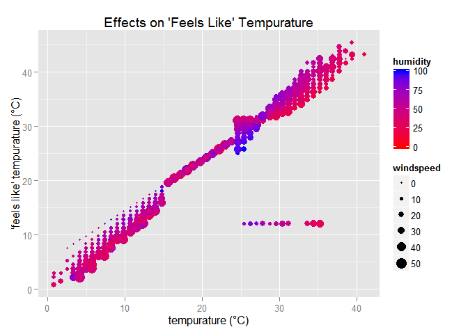
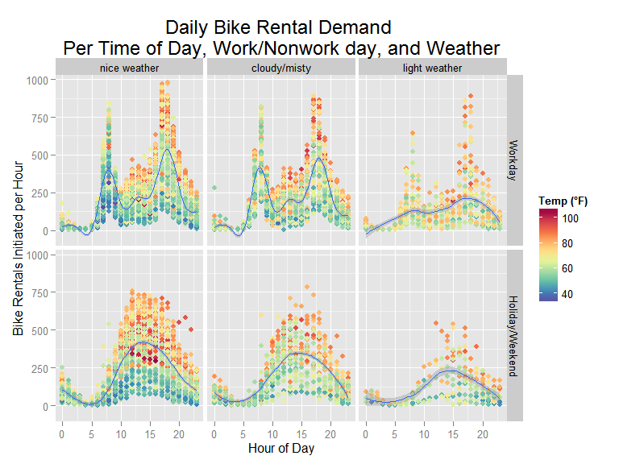

# Bike Sharing Program: Rental Demand Prediction from Weather
MattDSquared (Matthew D. Davis)  
Monday, May 25, 2015  

_From the competition host, Kaggle.com_

Bike sharing systems are a means of renting bicycles where the process of obtaining membership, rental, and bike return is automated via a network of kiosk locations throughout a city. Using these systems, people are able rent a bike from a one location and return it to a different place on an as-needed basis. Currently, there are over 500 bike-sharing programs around the world.

The data generated by these systems makes them attractive for researchers because the duration of travel, departure location, arrival location, and time elapsed is explicitly recorded. Bike sharing systems therefore function as a sensor network, which can be used for studying mobility in a city. In this competition, participants are asked to combine historical usage patterns with weather data in order to forecast bike rental demand in the Capital Bikeshare program in Washington, D.C.

###Acknowledgements

Kaggle is hosting this competition for the machine learning community to use for fun and practice. This dataset was provided by Hadi Fanaee Tork using data from Capital Bikeshare. We also thank the UCI machine learning repository for hosting the dataset. If you use the problem in publication, please cite:

Fanaee-T, Hadi, and Gama, Joao, Event labeling combining ensemble detectors and background knowledge, Progress in Artificial Intelligence (2013): pp. 1-15, Springer Berlin Heidelberg.

## Project Setup


```r
library(ggplot2)
library(ggdendro)
library(lubridate)
library(plyr); library(dplyr)
library(randomForest)
library(scales)

sessionInfo()
```

```
## R version 3.1.3 (2015-03-09)
## Platform: x86_64-w64-mingw32/x64 (64-bit)
## Running under: Windows 7 x64 (build 7601) Service Pack 1
## 
## locale:
## [1] LC_COLLATE=English_United States.1252 
## [2] LC_CTYPE=English_United States.1252   
## [3] LC_MONETARY=English_United States.1252
## [4] LC_NUMERIC=C                          
## [5] LC_TIME=English_United States.1252    
## 
## attached base packages:
## [1] stats     graphics  grDevices utils     datasets  methods   base     
## 
## other attached packages:
## [1] scales_0.2.4        randomForest_4.6-10 dplyr_0.4.1        
## [4] plyr_1.8.1          lubridate_1.3.3     ggdendro_0.1-15    
## [7] ggplot2_1.0.1      
## 
## loaded via a namespace (and not attached):
##  [1] assertthat_0.1   colorspace_1.2-4 DBI_0.3.1        digest_0.6.8    
##  [5] evaluate_0.7     formatR_1.0      grid_3.1.3       gtable_0.1.2    
##  [9] htmltools_0.2.6  knitr_1.10.5     magrittr_1.5     MASS_7.3-39     
## [13] memoise_0.2.1    munsell_0.4.2    parallel_3.1.3   proto_0.3-10    
## [17] Rcpp_0.11.5      reshape2_1.4.1   rmarkdown_0.3.11 stringi_0.4-1   
## [21] stringr_1.0.0    tools_3.1.3      yaml_2.1.13
```

```r
setwd("~/../datascience/BikeSharingDemand")
graphics.off()
windows.options(width = 12, height = 8, xpinch=96, ypinch=96, xpos=0, ypos=0)
```

## Data Processing

Data is made available at https://www.kaggle.com/c/bike-sharing-demand/data. A Kaggle account is required. This needs to be downloaded manually (it's behind a login, which just complicates automated download). Alternatively, forking the BikeSharingDemand repo at https://github.com/MattDSquared/BikeSharingDemand will include this data set. 


```r
dir.create("data")
train.filepath <- "data/train.csv"
test.filepath <- "data/test.csv"

# download train and test data sets from 
# https://www.kaggle.com/c/bike-sharing-demand/data
# place train.csv and test.csv into data subdirectory
# data obtained 2015-05-25
```

Load the data into train and test data sets.


```r
train <- read.csv(train.filepath, stringsAsFactors=FALSE)
test <- read.csv(test.filepath, stringsAsFactors=FALSE)
```

Text data is cleaned up and simplified. The weather labels are a bit verbose, see the [competition data](https://www.kaggle.com/c/bike-sharing-demand/data) page for formal weather descriptions.


```r
weatherlabels <- c("nice weather", "cloudy/misty", "light weather",
                   "heavy weather")
seasons <- c("spring", "summer", "fall", "winter")
daysoftheweek <- c("Monday","Tuesday","Wednesday","Thursday","Friday",
                   "Saturday","Sunday")
train <- mutate(train, 
                datetime = ymd_hms(datetime),
                season = factor(season, levels=1:4, labels=seasons),
                holiday = as.logical(holiday),
                workingday = factor(workingday, levels=c(1,0), 
                                    labels=c("Workday","Holiday/Weekend")),
                weather = factor(weather,levels=1:4, labels=weatherlabels),
                dayofweek = factor(weekdays(datetime), levels=daysoftheweek),
                timeofday = hour(datetime))
test <- mutate(test, 
                datetime = ymd_hms(datetime),
                season = factor(season, levels=1:4, labels=seasons),
                holiday = as.logical(holiday),
                workingday = factor(workingday, levels=c(1,0), 
                                    labels=c("Workday","Holiday/Weekend")),
                weather = factor(weather,levels=1:4, labels=weatherlabels),
                dayofweek = factor(weekdays(datetime), levels=daysoftheweek),
                timeofday = hour(datetime))
```

The data only show a single heavy weather point in the midst of several light weather points. For graphing purposes, replace with light weather. Implicit assumption: bike rentals during heavy weather will be negligible. 


```r
print(which(train$weather == "heavy weather"))
```

```
## [1] 5632
```

```r
print(which(test$weather == "heavy weather"))
```

```
## [1]  155 3249
```

```r
print(train[which(train$weather == "heavy weather")+(-5):6,c("datetime","weather", "temp", "count")])
```

```
##                 datetime       weather  temp count
## 5627 2012-01-09 13:00:00  cloudy/misty 10.66    80
## 5628 2012-01-09 14:00:00 light weather  9.02    50
## 5629 2012-01-09 15:00:00 light weather  9.02    69
## 5630 2012-01-09 16:00:00 light weather  9.02    49
## 5631 2012-01-09 17:00:00 light weather  9.02   152
## 5632 2012-01-09 18:00:00 heavy weather  8.20   164
## 5633 2012-01-09 19:00:00 light weather  8.20   190
## 5634 2012-01-09 20:00:00  cloudy/misty  8.20   132
## 5635 2012-01-09 21:00:00  cloudy/misty  8.20    79
## 5636 2012-01-09 22:00:00  cloudy/misty  8.20    62
## 5637 2012-01-09 23:00:00  cloudy/misty  9.02    52
## 5638 2012-01-10 00:00:00  cloudy/misty  9.02    14
```

```r
## interpolate heavy weather as light weather for graphing purposes
train$weather[train$weather == "heavy weather"] = "light weather"
test$weather[test$weather == "heavy weather"] = "light weather"
```

This should be explored further. Is this data set applicable to the DC area, since it essentially doesn't include heavy weather data which does occur in the DC area. 

## What is atemp?

The atemp variable in the data set is the "feels like" temperature based on weather factors. The plot below illustrates this relationship.


```r
## atemp vs. temperature, weather
gg <- ggplot(train, aes(temp, atemp, color=humidity, size=windspeed)) +
    geom_point() +
    scale_colour_gradient(low="red",high="blue") + 
    labs(title="Effects on 'Feels Like' Tempurature") +
    labs(x="tempurature (°C)") +
    labs(y="'feels like' tempurature (°C)")
windows()
print(gg)
```

 

This shows the effects of windchill below about 15°C and humidity above about 24°C. Note the data contains few points below 5°C, which could be an issue for the DC area. 

Also note the outliers to the lower right of the main grouping. These 24 data all occur on a single day in august.
Note the fixed atemp value of 12.12. For simplicity, assume for these values atemp = temp.


```r
select(filter(train, atemp < 15, temp > 24), datetime, weather, temp, atemp, humidity, windspeed)
```

```
##               datetime       weather  temp atemp humidity windspeed
## 1  2012-08-17 00:00:00  nice weather 27.88 12.12       57   11.0014
## 2  2012-08-17 01:00:00  nice weather 27.06 12.12       65    7.0015
## 3  2012-08-17 02:00:00  nice weather 27.06 12.12       61    8.9981
## 4  2012-08-17 03:00:00  nice weather 26.24 12.12       65    7.0015
## 5  2012-08-17 04:00:00  nice weather 26.24 12.12       73   11.0014
## 6  2012-08-17 05:00:00  nice weather 26.24 12.12       73    7.0015
## 7  2012-08-17 06:00:00  nice weather 25.42 12.12       78    8.9981
## 8  2012-08-17 07:00:00  nice weather 26.24 12.12       73    7.0015
## 9  2012-08-17 08:00:00  nice weather 27.88 12.12       65    8.9981
## 10 2012-08-17 09:00:00  nice weather 28.70 12.12       58    7.0015
## 11 2012-08-17 10:00:00  nice weather 30.34 12.12       55   11.0014
## 12 2012-08-17 11:00:00  nice weather 31.16 12.12       52   19.0012
## 13 2012-08-17 12:00:00  nice weather 33.62 12.12       41   15.0013
## 14 2012-08-17 13:00:00  nice weather 34.44 12.12       36   26.0027
## 15 2012-08-17 14:00:00  nice weather 35.26 12.12       34   27.9993
## 16 2012-08-17 15:00:00  nice weather 35.26 12.12       30   31.0009
## 17 2012-08-17 16:00:00  cloudy/misty 34.44 12.12       32   30.0026
## 18 2012-08-17 17:00:00  nice weather 33.62 12.12       36   22.0028
## 19 2012-08-17 18:00:00  cloudy/misty 33.62 12.12       38   16.9979
## 20 2012-08-17 19:00:00  cloudy/misty 30.34 12.12       55   26.0027
## 21 2012-08-17 20:00:00  cloudy/misty 29.52 12.12       58   15.0013
## 22 2012-08-17 21:00:00  cloudy/misty 27.88 12.12       69   19.9995
## 23 2012-08-17 22:00:00 light weather 27.06 12.12       83   12.9980
## 24 2012-08-17 23:00:00 light weather 26.24 12.12       83   15.0013
```

```r
# replace atemp with temp for outliers
train <- mutate(train, atemp=ifelse((atemp < 15) & (temp > 24), temp, atemp))
test <- mutate(test, atemp=ifelse((atemp < 15) & (temp > 24), temp, atemp))
```

It appears wind and humidity are already packaged into the 'feels like' temperature value. The key is to find out how much that matters. 

## Primary demand drivers

### principal component analysis (PCA)

A principal component analysis (PCA) on the data shows how variation in the input data can be explained by a same-sized set of orthogonal variables. In other words, it indicates where most of the information is contained in a data set. 


```r
tr.inputs <- select(train, datetime:windspeed)
train.svd <- svd(scale(sapply(tr.inputs, unclass)))

gg <- ggplot() + 
    geom_bar(aes(x=1:length(train.svd$d), y=train.svd$d^2/sum(train.svd$d^2)),
             stat="identity",
             fill="dodgerblue") + 
    scale_x_discrete(limits=1:length(tr.inputs)) +
    labs(title="Feature Variance") +
    labs(x="Orthogonal variables") +
    labs(y="Proportion of variance explained")
print(gg)
```

 

The last eigenvalue (variable 9 above) appears to contribute a negligible amount of information to the input data. The below plot shows the components of this eigenvalue are temperature, 'feels like' temperature, and a little of wind and humidity. This is consistent with our earlier exploration. The low eigenvalue here means that at least one of these 4 variables can be completely neglected. 


```
## Warning in loop_apply(n, do.ply): Stacking not well defined when ymin != 0
```

 

Finally, exploring the composition of eigenvalue 1 shows that about 1.5726\times 10^{4}% of the data variation comes from datetime, season, temperature, and a little of windspeed. This means date, time, season, temperature and to some extent wind are intertwined pieces of information, as one might expect. 


```
## Warning in loop_apply(n, do.ply): Stacking not well defined when ymin != 0
```

 

Due to the broad spread of orthogonal data across a variety of features, an optimal solution will likely include most of the provided data, with the exception of temp/atemp. These two variables provide very little additional information between each other. 

### Effect of Time of day, weather, and working/non-working days

The below plot shows the effect of time, temperature, weather, and work/nonwork days on daily rental counts. The initial idea for this plot came from [this kaggle script post](https://www.kaggle.com/users/993/ben-hamner/bike-sharing-demand/bike-rentals-by-time-and-temperature) by Ben Hamner, which has been expanded here. 


```r
colors.tempurature <- c("#5e4fa2", "#3288bd", "#66c2a5", "#abdda4", "#e6f598",
                        "#fee08b", "#fdae61", "#f46d43", "#d53e4f", "#9e0142")

gg <- ggplot(train, aes(timeofday, count, color=9/5*temp+32)) +
    facet_grid(workingday ~ weather) +
    geom_point() +
    geom_smooth() +
    theme(plot.title = element_text(size = rel(1.5))) +
    labs(title="Daily Bike Rental Demand \nPer Time of Day, Work/Nonwork day, and Weather") + 
    labs(x="Hour of Day") + 
    labs(y="Bike Rentals Initiated per Hour") +
    scale_colour_gradientn("Temp (°F)", colours=colors.tempurature)
windows()
print(gg)
```

 

Features to note:

* Sinusoidal shape of demand with respect to hour of the day.
* Weather does not greatly affect the shape of the demand curve with respect to time of day, just the magnitude and density. 
* Weather does seem to effect the average temperature of the data.
* Dependence on demand to atemp, with peak demand in the 80-100°F range. 
* Distinctly differing shape between a work and non-work day, with 
* Peak demand occurs in the afternoon of a warm, nice-weather, work-day.

## Model Development

A random forest model is a convenient method for predicting rental counts given a specified set of variables and is robust to irrelevant or overlapping features. This script is essentially a copy of Ben Hamner's submission for [What drives demand for DC bike rentals?](https://www.kaggle.com/benhamner/bike-sharing-demand/what-drives-demand-for-dc-bike-rentals). 


```r
# features used is modified slightly
train.features <- select(train, season, dayofweek, timeofday, workingday, 
                         weather, temp, humidity, windspeed)

# this is baller Hamner R code, no credit taken here.
train.rf <- randomForest(train.features, train$count, ntree=100, importance=TRUE)

imp <- importance(train.rf, type=1)
featureImportance <- data.frame(Feature=row.names(imp), Importance=imp[,1])

ggplot(featureImportance, aes(x=reorder(Feature, Importance), y=Importance)) +
     geom_bar(stat="identity", fill="#53cfff") +
     coord_flip() + 
     theme_light(base_size=16) +
     xlab("") + 
     ylab("Relative Importance") +
     theme(plot.title   = element_text(size=18),
           strip.text.x = element_blank(),
           axis.text.x  = element_blank(),
           axis.ticks.x = element_blank())
```

 

Ben also had a wonderful way to visualize the individual feature contributions using scaled partial plots of each feature and their effect on count. Again, not credit taken on my part. 


```r
partials <- data.frame()

for (i in seq_along(names(train.features))) {
  partial <- partialPlot(train.rf, sapply(train.features, unclass), 
                         names(train.features)[i], 
                         plot=FALSE)
  xt <- rescale(partial$x)
  partials <- rbind(partials, data.frame(x=partial$x, xt=xt, y=partial$y, 
                                         feature=names(train.features)[i]))
}

ranges <- ddply(partials, "feature", function(d) {
  r <- range(d$y)
  data.frame(feature=d$feature[1], range=r[2]-r[1])
})

features_to_plot <- ranges[ranges$range>0.05*max(ranges$range),"feature"]

ggplot(partials[partials$feature %in% features_to_plot,], 
       aes(x=xt, y=y, color=feature)) +
  geom_line(size=2) +
  theme_light(base_size=16) +
  xlab("Feature Range (Min to Max)") +
  ylab("Hourly Bike Rentals") 
```

 


```r
# TODO: move select call to separate extract_features function
prediction <- predict(train.rf, select(test, season, dayofweek, timeofday, workingday, weather, temp, humidity, windspeed))

export.df <- data.frame(datetime=test$datetime,count=prediction)

write.csv(export.df,file="data/Submission2.csv", quote=FALSE, row.names=FALSE)
```

## Future Work

Items remaining for future work:

* Include wind and humidity in the data exploration. 
* Explore alternative prediction techniques.
* Determine if data set is applicable to the DC weather patterns. Data appears to be from much more temperate climate which could greatly affect weather-based behavior. Theory: residents get accustomed to their "average" weather condition, adjusting outdoor activity accordingly. 
